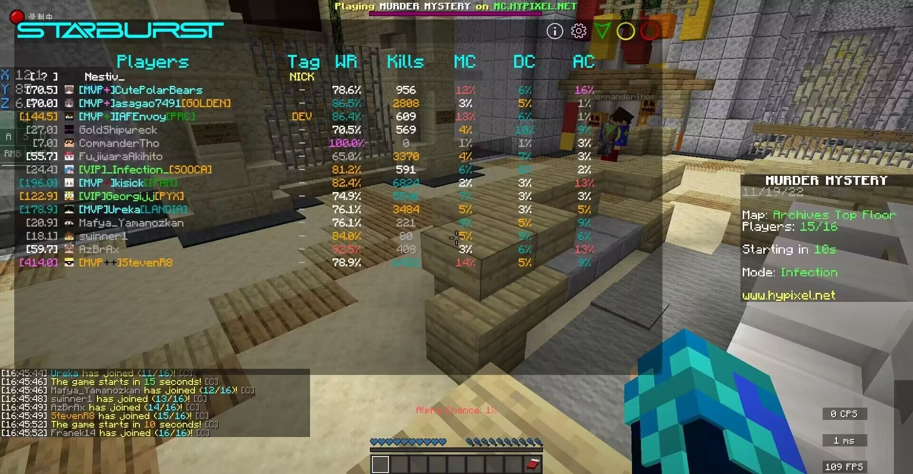
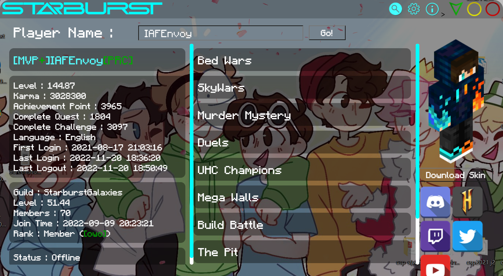
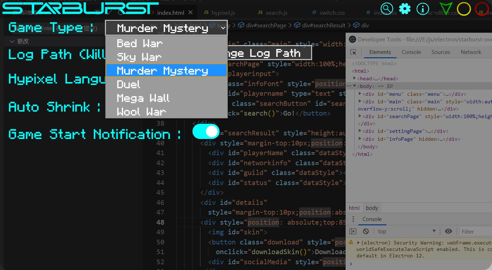

#  Starburst Overlay
 

*这个软件是用我工会的名字命名的，也是用来纪念它的*

[English](https://github.com/IAFEnvoy/StarburstOverlay/blob/master/README.md) | **中文**

Starburst Overlay是一个高速并且多功能的Hypixel数据查询软件

-> 最新介绍视频

## 目录
- [特性](#特性)
- [使用方法](#使用方法)
- [预览](#预览)
- [Bug汇报](#Bug汇报)
- [未来计划](#未来计划)
- [下载](https://github.com/IAFEnvoy/StarburstOverlay/releases)

## 特性
### 游戏内数据查询
1.自动下载并且简要的显示玩家数据。 （**非常非常快!**）

2.对于不同等级的数据显示不同的颜色。

3.支持起床战争，空岛战争，密室杀手，决斗，超级战墙和羊毛战争。（更多游戏模式将在未来加入）

4.游戏开始时给你发送一条消息。

5.窗口置顶并且在不需要的时候自动收起。

### 全部数据查询
1.通过点击按钮或者直接在`游戏内数据查询`中点击玩家名字来打开。

2.支持Network数据，工会，在线状态，起床战争，空岛战争，密室杀手，决斗，UHC，超级战墙，建筑大师，天坑乱斗，闪电饥饿游戏和部分街机游戏。

3.显示玩家皮肤（可以下载）和在服务器内绑定的社交账号。

**这个功能源自[Hypixel Overlay](https://github.com/IAFEnvoy/HypixelOverlay)，那个将不再维护**

### 其他特性
1.安全并且非常稳定

2.完全开源！

#### 更多特性将在未来加入（你也可以在issue中告诉我你想加入什么）

### 使用方法
1.下载并运行安装程序

2.打开Starburst Overlay

3.在设置界面中设置latest.log路径（按以打开设置界面）

4.通过在服务器中运行`/api new`或者直接修改软件目录中的`config.json`来设置API key

5.打开你的游戏并且运行`/who`（软件将会在需要运行`/who`的时候告诉你）

6.尽情享用吧**ヾ(≧▽≦\*)o**

### 预览

### Bug汇报
如果你发现任何bug或者有好的想法，请在这个仓库中提交issue。

### 未来计划
1.更多游戏模式

2.更新提示 (✔)

3.支持MacOS和Linux

4.对数据进行排序

5.更多游戏语言支持